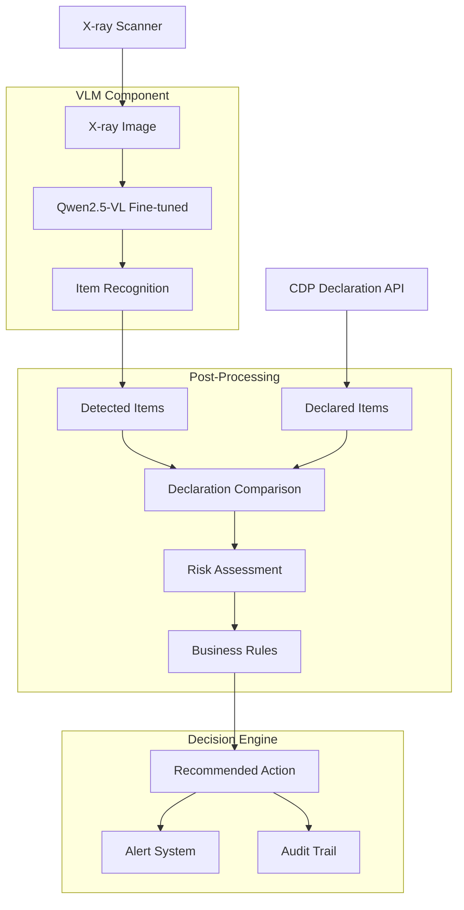
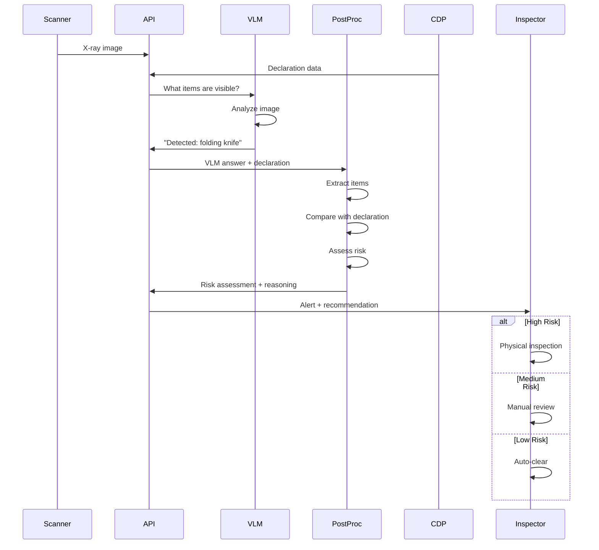

# System Architecture

## Design Philosophy

The X-ray inspection system follows a **separation of concerns** principle:

1. **VLM (Vision-Language Model)**: Focuses ONLY on item recognition
2. **Post-processing**: Handles declaration comparison and risk assessment
3. **Business Rules**: Manages workflow decisions

This design provides:
- **Better model performance** - VLM learns one task well
- **Flexibility** - Easy to update business rules without retraining
- **Transparency** - Clear separation between AI and rule-based logic
- **Maintainability** - Each component can be tested and updated independently

## System Flow



## Component Details

### 1. VLM Component (Vision-Language Model)

**Responsibility:** Recognize items in X-ray scans

**Input:**
```json
{
  "image": "X-ray scan",
  "question": "What items are visible in this X-ray scan?"
}
```

**Output:**
```json
{
  "answer": "Detected items: a folding knife at center-left, partially concealed."
}
```

**Training Data Format:**
```jsonl
{
  "image_path": "data/opixray/images/P00001.jpg",
  "question": "What items are visible in this X-ray scan?",
  "answer": "Detected items: a folding knife.",
  "metadata": {
    "categories": ["Folding_Knife"],
    "has_occlusion": true
  }
}
```

**Question Types:**
1. **General**: "What items are visible?"
2. **Specific**: "Is there a knife in this scan?"
3. **Location**: "Where are the items located?"
4. **Occlusion**: "Are any items concealed?"
5. **Detailed**: "Provide detailed description of all items"

**Key Features:**
- Focuses on item recognition only
- No declaration comparison in training
- Learns to detect occlusion/concealment
- Provides location descriptions

### 2. Post-Processing Component

**Responsibility:** Compare detected items with declarations and assess risk

**Location:** `inference/postprocess.py`

**Functions:**

#### a) Item Extraction
```python
extract_items_from_text(text: str) -> List[str]
```
Parses VLM answer to extract detected item names.

#### b) Declaration Comparison
```python
compare_with_declaration(
    detected_items: List[str],
    declared_items: List[str]
) -> Dict
```

Returns:
```python
{
    "declaration_match": False,
    "matched_items": ["scissors"],
    "undeclared_items": ["folding knife"],  # FRAUD INDICATOR
    "undetected_items": [],
}
```

#### c) Risk Assessment
```python
assess_risk_level(
    detected_items: List[str],
    declaration_comparison: Dict,
    has_occlusion: bool
) -> str  # "low", "medium", "high"
```

**Risk Level Logic:**
- **HIGH**: Multiple prohibited items OR concealed items OR undeclared prohibited items
- **MEDIUM**: Single prohibited item
- **LOW**: No prohibited items

#### d) Action Determination
```python
determine_action(risk_level: str) -> str
```

**Action Mapping:**
- **LOW** → CLEAR (automated clearance)
- **MEDIUM** → REVIEW (manual review)
- **HIGH** → PHYSICAL_INSPECTION (mandatory inspection)

#### e) Reasoning Generation
```python
generate_reasoning(...) -> str
```

Generates human-readable explanation:
```
"Detected items: folding knife. ALERT: Undeclared items found - folding knife. 
Warning: Items appear to be intentionally concealed. 
High risk detected - immediate physical inspection required."
```

### 3. API Integration

**Endpoint:** `POST /api/v1/inspect`

**Request:**
```json
{
  "scan_id": "SCAN-2026-001234",
  "image_base64": "base64_encoded_image",
  "declared_items": ["clothing", "electronics"]
}
```

**Processing Pipeline:**
```python
# Step 1: VLM Inference (item recognition)
vlm_answer = vllm_server.generate("What items are visible?")
# Output: "Detected items: a folding knife at center-left."

# Step 2: Post-processing (declaration comparison + risk)
result = process_vlm_response(
    vlm_answer=vlm_answer,
    declared_items=["clothing", "electronics"]
)
# Output: {
#   "detected_items": ["folding knife"],
#   "risk_level": "high",
#   "undeclared_items": ["folding knife"],
#   "recommended_action": "PHYSICAL_INSPECTION"
# }

# Step 3: Format response
return InspectionResponse(...)
```

**Response:**
```json
{
  "scan_id": "SCAN-2026-001234",
  "risk_level": "high",
  "detected_items": [
    {
      "item": "folding knife",
      "confidence": 0.85,
      "location": "center-left",
      "occluded": true
    }
  ],
  "declaration_match": false,
  "reasoning": "Detected items: folding knife. ALERT: Undeclared items...",
  "recommended_action": "PHYSICAL_INSPECTION",
  "processing_time_ms": 347
}
```

## Data Flow Diagram



## Training vs Inference

### Training Phase

**Focus:** Item recognition ONLY

**Data:**
```jsonl
{"question": "What items are visible?", "answer": "Detected items: knife."}
{"question": "Is there a knife?", "answer": "Yes, a knife at center-left."}
{"question": "Are any items concealed?", "answer": "Yes, partially concealed items detected."}
```

**What the VLM learns:**
- Identify items in X-ray images
- Detect occlusion/concealment
- Describe item locations
- Handle various question formats

**What the VLM does NOT learn:**
- Declaration comparison (done in post-processing)
- Risk assessment (done in post-processing)
- Action recommendations (done in business rules)

### Inference Phase

**Pipeline:**
1. **VLM**: Recognize items → "Detected: knife"
2. **Post-processing**: Compare with declaration → "Undeclared knife detected"
3. **Risk assessment**: Assess → "High risk"
4. **Business rules**: Recommend action → "Physical inspection"

## Advantages of This Architecture

### 1. Better Model Performance
- VLM focuses on one task: item recognition
- Simpler task → better accuracy
- Less confusion during training

### 2. Easier Updates
- Update risk rules without retraining VLM
- Adjust business logic independently
- Quick deployment of policy changes

### 3. Transparency
- Clear separation between AI (item detection) and rules (risk assessment)
- Easy to audit and explain decisions
- Regulatory compliance

### 4. Flexibility
- Can use different models for different components
- Easy to A/B test different risk rules
- Modular architecture

### 5. Testing
- Test VLM independently (item recognition accuracy)
- Test post-processing independently (declaration logic)
- Test business rules independently (action decisions)

## Configuration

### VLM Configuration
```yaml
# configs/train_local.yaml
model_name: Qwen/Qwen2.5-VL-7B-Instruct
image_resolution: 448
max_seq_length: 2048
```

### Post-Processing Configuration
```python
# inference/postprocess.py
PROHIBITED_ITEMS = ["knife", "blade", "scissors"]

RISK_HIGH_CONDITIONS = [
    "multiple_prohibited_items",
    "concealed_items",
    "undeclared_prohibited_items"
]

ACTION_MAPPING = {
    "low": "CLEAR",
    "medium": "REVIEW",
    "high": "PHYSICAL_INSPECTION"
}
```

### Business Rules Configuration
```python
# Can be externalized to config file
RISK_THRESHOLDS = {
    "multiple_items": 2,
    "concealment_penalty": 1.5,
    "undeclared_penalty": 2.0
}
```

## Extension Points

### Adding New Item Categories
1. Add to VLM training data
2. Retrain VLM
3. Update `PROHIBITED_ITEMS` in post-processing

### Updating Risk Rules
1. Modify `assess_risk_level()` in `postprocess.py`
2. No retraining needed
3. Deploy immediately

### Integrating Additional Checks
1. Add new post-processing functions
2. Call in pipeline
3. Integrate results into risk assessment

Example:
```python
# New check: cross-reference with watchlist
def check_passenger_watchlist(passenger_id: str) -> bool:
    ...

# Integrate in post-processing
if check_passenger_watchlist(scan["passenger_id"]):
    risk_level = max(risk_level, "high")
```

## Performance Considerations

### VLM Inference
- **Latency**: ~300-400ms per image (vLLM)
- **Bottleneck**: GPU computation

### Post-Processing
- **Latency**: <10ms (CPU)
- **Bottleneck**: None (pure Python logic)

### Total Pipeline
- **Target**: <500ms end-to-end
- **Achievable**: Yes, VLM is the main latency source

## Summary

This architecture separates:
1. **VLM** → What is in the scan?
2. **Post-processing** → Does it match the declaration?
3. **Business rules** → What should we do?

Benefits:
- ✅ Better model accuracy
- ✅ Faster iteration cycles
- ✅ Easier maintenance
- ✅ More transparent decisions
- ✅ Flexible policy updates
