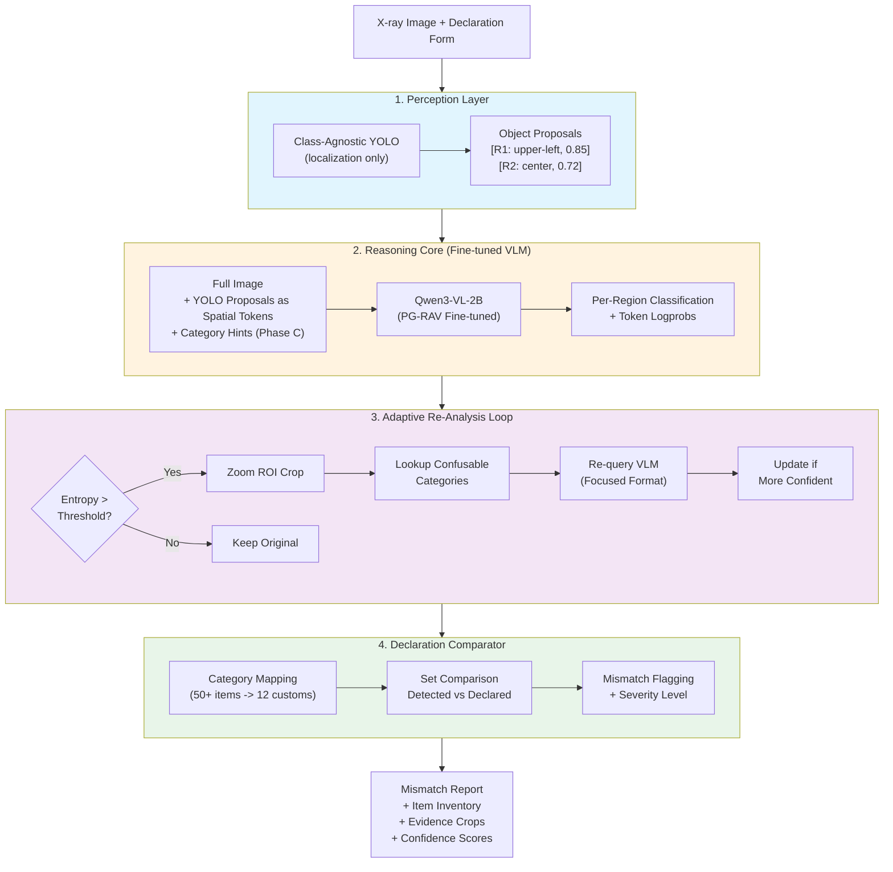
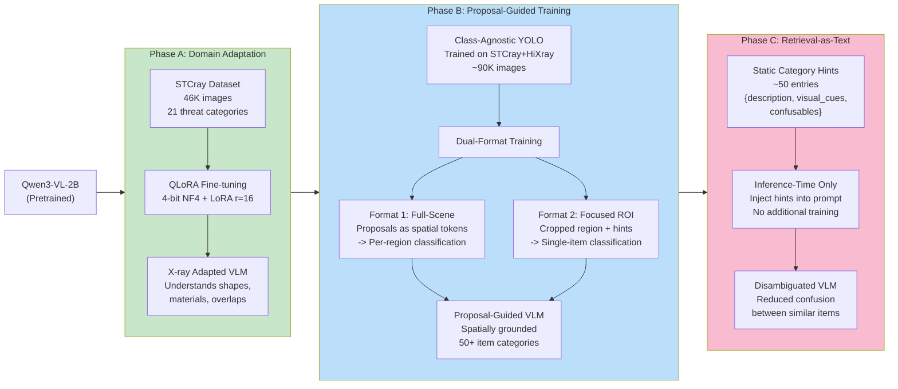
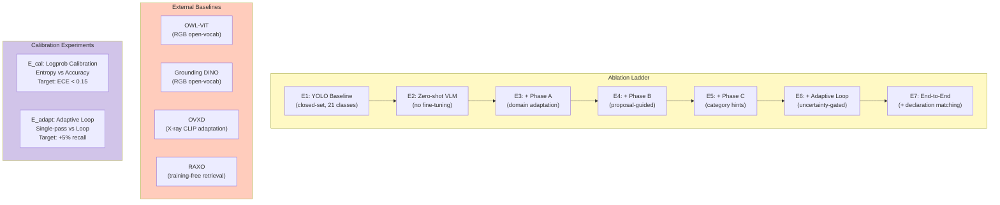
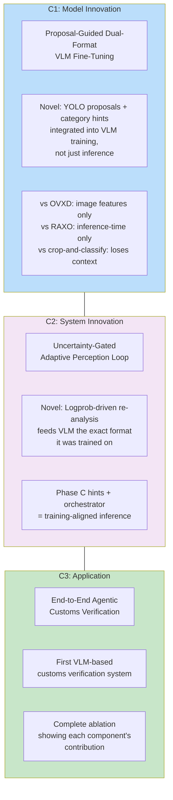
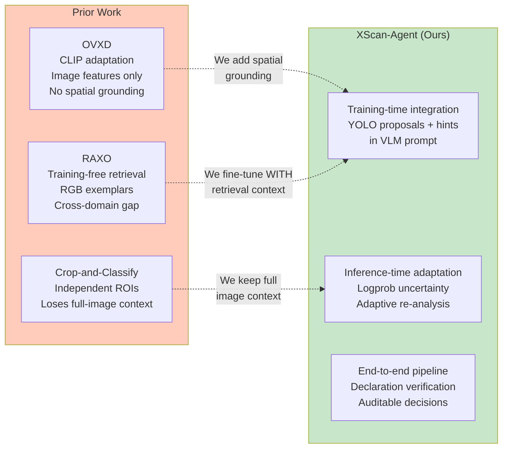

# XScan-Agent Paper Architecture Diagrams

## 1. System Architecture (End-to-End Pipeline)

## 2. Fine-Tuning Curriculum (Three-Phase Training)

## 3. Ablation Structure (Paper Experiments)

## 4. Contributions Overview

## 5. Comparison with Prior Work

